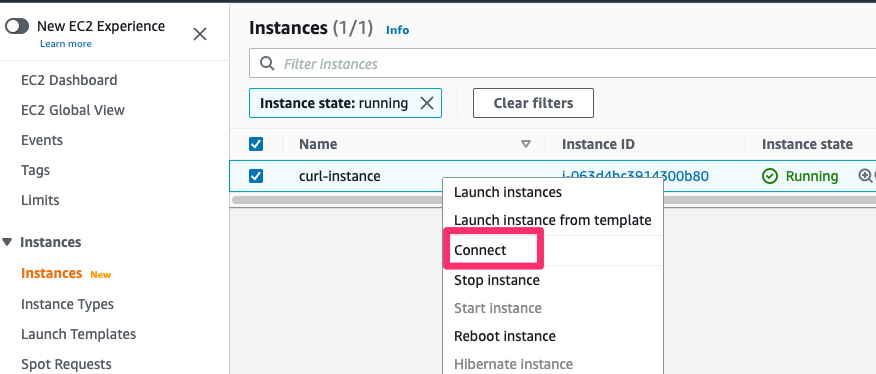
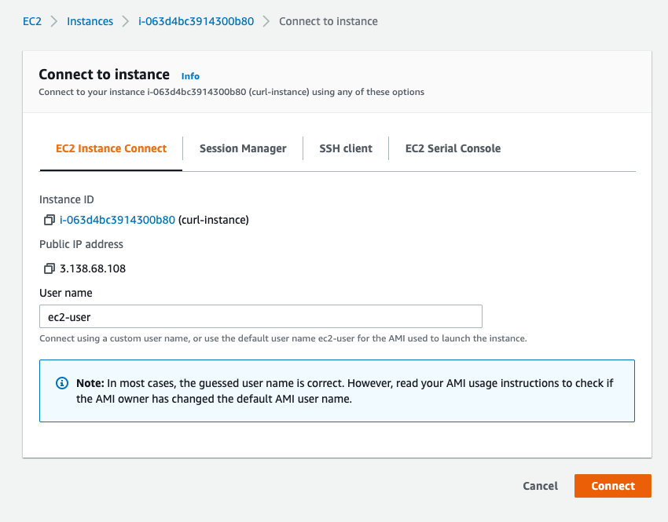

# INTRODUCTION

These examples demonstrate typical deployment procedures as part of Udacity course "Site Reliability Engineer". 

The exercises comprise four different deployment strategies:
1. Exercise # 1 - Basic Deployment (on local Docker Desktop Kubernetes)
2. Exercise # 2 - Rolling Deployment (on local Docker Desktop Kubernetes)
3. Exercise # 3 - Canary Deployment (on local Docker Desktop Kubernetes)
4. Exercise # 4 - Blue-Green Deployment (on AWS)

# PREPARATIONS

## Mandatory local Kubernetes Setup
1. [Docker Desktop](https://www.docker.com/products/docker-desktop/) with activated Kubernetes
2. [Kubectl](https://kubernetes.io/docs/reference/kubectl/)

## Kubernetes Helper Libraries
- [Kubectx](https://github.com/ahmetb/kubectx#kubectx1)
- [kubens](https://github.com/ahmetb/kubectx#kubens1)

## AWS CLI Setup with multiple profiles (didn't get it work with the udacity aws credentials)
Based on [Set Up the AWS CLI](https://aws.amazon.com/de/getting-started/guides/setup-environment/module-three/) 
proceed as follows:

1. Install the AWS CLI and verify with: `aws --version`
2. Create new profile with `aws configure --profile <profile_name>` and set:
   1. AWS Access Key ID
   2. AWS Secret Access Key
   3. Default Region (e.g. us-east-1)
   4. Default Output Format (i.e. json)
3. Get the available profiles with `aws configure list-profiles`
4. Switch the profile depending on your OS with:
   1. Linux and MacOS -> `export AWS_PROFILE=admin`
   2. Windows Command Prompt -> `setx AWS_PROFILE admin`
   3. PowerShell -> `$Env:AWS_PROFILE="admin"`
5. Get the currently used profile with `aws configure list`
6. Verify the currently active profile with `aws sts get-caller-identity` 
7. Exemplary list S3 buckets from this profile with: `aws s3 ls --profile <profile_name>`
8. Remove unwanted profiles (or add manually), by editing the config files:
   1. `vi ~/.aws/credentials`
   2. `vi ~/.aws/config` 

## Visualizing Local Kubernetes Cluster
You may visualize your local kubernetes cluster using the `ops-view` deployment found in the [visual-support](https://github.com/udacity/nd087-c3-self-healing-architectures-exercises/tree/7ff0779bfbc514ca11334bd3912d8d6060e50533/lesson-2-deployment-strategies/exercises/starter/visual-support) directory
1. `kubectl apply -f visual-support/ops-view.yml`
2. Visit the URL `http://localhost:30092/` on your browser

Remove this deployment using: `kubectl delete -f visual-support/ops-view.yml`

## Visualizing AWS EKS Cluster
You may visualize your AWS EKS cluster using the helm chart `kube-ops-view`

1. Install [helm](https://www.eksworkshop.com/beginner/060_helm/helm_intro/install/)
2. Add the stable repo: `helm repo add stable https://charts.helm.sh/stable`
3. Install the helm chart `kube-ops-view`
    ```
    helm install kube-ops-view \
    stable/kube-ops-view \
    --set service.type=LoadBalancer \
    --set rbac.create=True
    ```
4. Confirm the helm chart is installed successfully
   - `helm list`

5. Get the service URL to view the cluster dashboard
- `kubectl get svc kube-ops-view | tail -n 1 | awk '{ print "Kube-ops-view URL = http://"$4 }'`

Remove this deployment using: `helm uninstall kube-ops-view`

# EXERCISES

## Exercise # 1 - Basic Deployment (on local Docker Desktop Kubernetes)
1. Ensure you have connectivity to your local kubernetes cluster
   1. `kubectl config use-context docker-desktop`
   2. Optional: Permanently switch namespace with `kubectl config set-context --current --namespace=udacity` and you do not need `-n udacity` at the end of every command
2. Apply the `basic-deployment.yml` deployment configuration file. 
   1. `kubectl apply -f basic-deployment.yml`
3. Take a screenshot of the running pods: 
   1. `kubectl get pods -n udacity`
4. Document the image number in the `nginx-basic` deployment
   1. Get the <container_name> from `kubectl get pods -n udacity` (one of them)
   2. Run `kubectl describe pod <container_name> -n udacity`
5. Now we will initiate a basic deployment for a newer version of nginx using `basic-deployment-image-bump.yml`
   1. `kubectl delete -f basic-deployment.yml`
   2. `kubectl apply -f basic-deployment-image-bump.yml`
6. Take a screenshot of the running pods: 
   1. `kubectl get pods -n udacity`
7. Document the image number in the `nginx-basic` deployment
    1. `kubectl describe deployment nginx-basic`
8. Tear down environment
    1. `kubectl delete all --all -n udacity`

## Exercise # 2 - Rolling Deployment (on local Docker Desktop Kubernetes)
1. Ensure you have connectivity to your local kubernetes cluster
   1. `kubectl config use-context docker-desktop`
   2. Optional: Permanently switch namespace with `kubectl config set-context --current --namespace=udacity` and you do not need `-n udacity` at the end of every command
2. Apply the `rolling_deploy.yml` deployment configuration file.
   1. `kubectl apply -f .\rolling_deploy.yml`
3. Take a screenshot of the running pods: `kubectl get pods -n udacity`
4. Document the image number in the `nginx-rolling` deployment
   1. Get the <container_name> from `kubectl get pods -n udacity` (one of them)
   2. Run `kubectl describe pod <container_name> -n udacity`
5. Now we will initiate a rolling deployment for a newer version of nginx via a bash script
   1. Run the bash script `./rolling.sh`
   2. Check that the procedure replaced all the containers with the new nginx version 
6. Now we will do the opposite and rollback the deployment to the previous version `1.20.1` and pause halfway through
   1. Update your script with the older image number then execute
   2. In a separate terminal pause the deployment with `kubectl rollout pause deployment nginx-rolling`
   3. Document the number of old and new versions deployed
   4. Then resume the deployment `kubectl rollout resume deployment nginx-rolling`
7. Tear down environment
   1. `kubectl delete all --all -n udacity`

## Exercise # 3 - Canary Deployment (on local Docker Desktop Kubernetes)
1. Ensure you have connectivity to your local kubernetes cluster
   1. `kubectl config use-context docker-desktop`
   2. Optional: Permanently switch namespace with `kubectl config set-context --current --namespace=udacity` and you do not need `-n udacity` at the end of every command
2. Apply the `index_v1_html.yml` & `index_v2_html.yml` configmaps to deploy the service html templates.
   1. Run `kubectl apply -f index_v1_html.yml`
   2. Run`kubectl apply -f index_v2_html.yml`
   3. Check with `kubectl get configmap -n udacity`
3. Deploy the service to the cluster (`canary-svc.yml`)
   1. Run 'kubectl apply -f .\canary-svc.yml'
   2. Check with 'kubectl get service -n udacity'   
4. Deploy the v1 & v2 starter template to the cluster (`canary-v1.yml`, `canary-v2.yml`)
   1. Run `kubectl apply -f .\canary-v1.yml` (container with v1 started right now)
   2. Run `kubectl apply -f .\canary-v2.yml` (You'll notice v2 has `0` replicas) 
5. Get the service cluster ip address and curl it 5 times to confirm only v1 of the application is reachable
   1. `kubectl get service canary-svc -n udacity`
   2. Use an ephermeral container to access the kubernetes internal network
      1. `kubectl run debug --rm -i --tty --image nicolaka/netshoot -- /bin/bash`
      2. `curl <service_ip>` and see `<html><h1>This is version 1</h1></html`
6. Now we will initiate a canary deployment for `canary-v2` via a bash script
   1. Run the bash script `./canary.sh`
   2. Check that the procedure replaced all the containers with the new nginx version
7. During the first manual verification step ensure you can curl the service and get a response from both versions of the application.
   1. Then continue until all replicas of v2 are deployed
8. Tear down environment
   1. `kubectl delete all --all -n udacity`

## Exercise # 4 - Blue-Green Deployment (on AWS)
1. Log into your student AWS account and switch to region `us-east-2`
2. Setup your local aws credentials
3. Launch the kubernetes cluster in starter terraform code provided
   1. `terraform init`
   2. `terraform plan`
   3. `terraform apply` optionally with parameter `--auto-approve`
4. Ensure you have connectivity to your aws kubernetes cluster
   1.`aws eks --region us-east-2 update-kubeconfig --name udacity-cluster`
   2.Change Kubernetes context to the new AWS cluster
   - `kubectl config use-context arn:aws:eks:us-east-2:225791329475:cluster/udacity-cluster`
   3. Confirm with: `kubectl get pods --all-namespaces`
   4. Change context to `udacity` namespace
      - `kubectl config set-context --current --namespace=udacity`
5. Apply the `index_blue_html.yml` & `index_green_html.yml` configmaps to deploy the service html templates.
   1. Run `kubectl apply -f .\index_blue_html.yml`
   2. Run `kubectl apply -f .\index_green_html.yml`
   3. Check with `kubectl get configmap`
6. Deploy the blue application to the cluster `blue.yml`
   1. Run `kubectl apply -f .\blue.yml` spawns the pods with app "blue"
   2. Check with `kubectl get pods` shows the running pods with app "blue"    
7. Check the deployment via curl
   1. Get the external ip from the load balancer with 'kubectl get svc'
   2. Run `curl <external_ip_of_loadbalancer>` to see `<html><h1>This is version BLUE</h1></html>`
   3. Or simply start your browser of choice: `<external_ip_of_loadbalancer>`
8. You'll notice there is a load balancer service created for you in the `kubernetes_resources.tf`
   1. There is also an associated dns zone `udacityexercise` in `dns.tf` that allows you to curl the hostname `blue-green.udacityexercise` from an ec2 instance
   2. Confirm you can curl this hostname from the created `curl-instance` ec2 instance (also created via terraform before)
      1. Connect to the ec2 instance via EC2 Instance Connect
         1. 
         2. 
      2. `curl blue-green.udacityexercise`
9. Mimic the `blue.yml` deployment script and create a `green.yml` which replaces all references of blue with green.
   1. Run `kubectl apply -f .\green.yml` spawns the "green" pods
   2. Check with `kubectl get pods` shows the "green" pods   
10. Prepare the AWS infrastructure for the "green" deployment 
    1. Change terraform file type from `green.todo` to `green.tf` in order to let Terraform make the following changes:
       1. Create the `green` service mimicking the `blue` service in `kubernetes_resources.tf` 
       2. Create dns record for the "green app" with the `set identifier` of `green` mimicking the `resource "aws_route53_record" "blue"` for blue in `dns.tf` 
    2. Run `terraform apply` to execute the change in AWS infrastructure (add two additional resources from above)
11. Connect to the `curl-instance` (EC2) and confirm you can receive results from both services
    1. Simply try `curl blue-green.udacityexercise` multiple times
    2. You will see randomly alternating blue and green service responses
12. Delete the blue DNS record from terraform and apply it
13. Connect to the `curl-instance` and confirm you only receive results from the green service
14. Tear down environment
    1. `terraform destroy --auto-approve` may need to run this multiple times