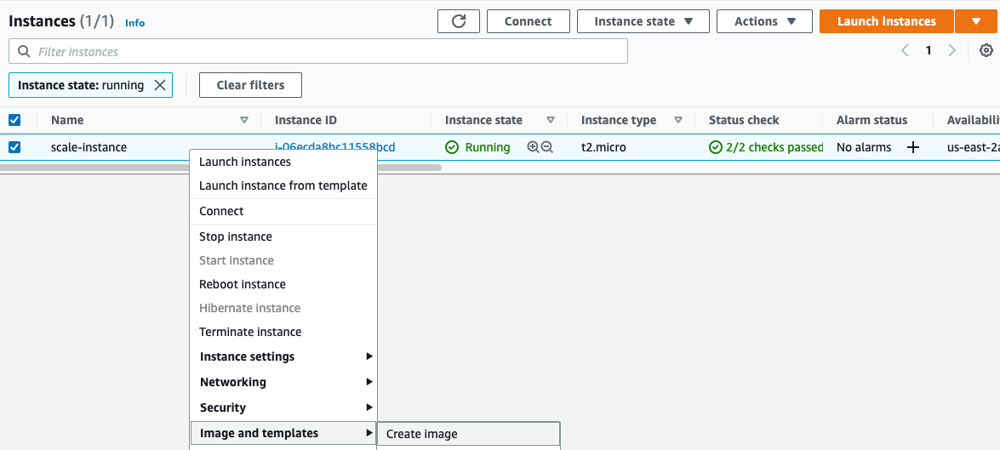
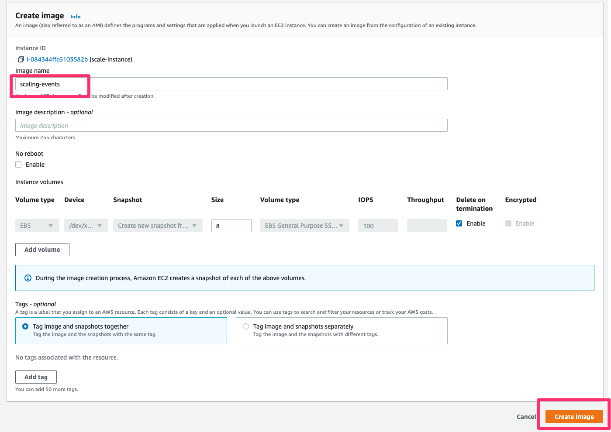
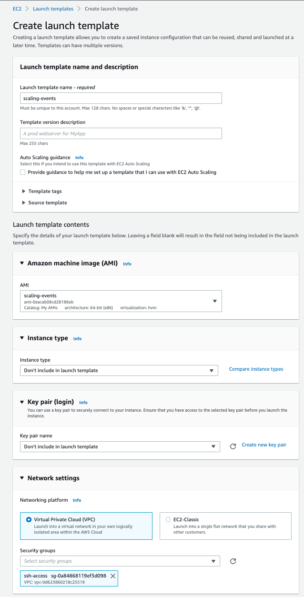
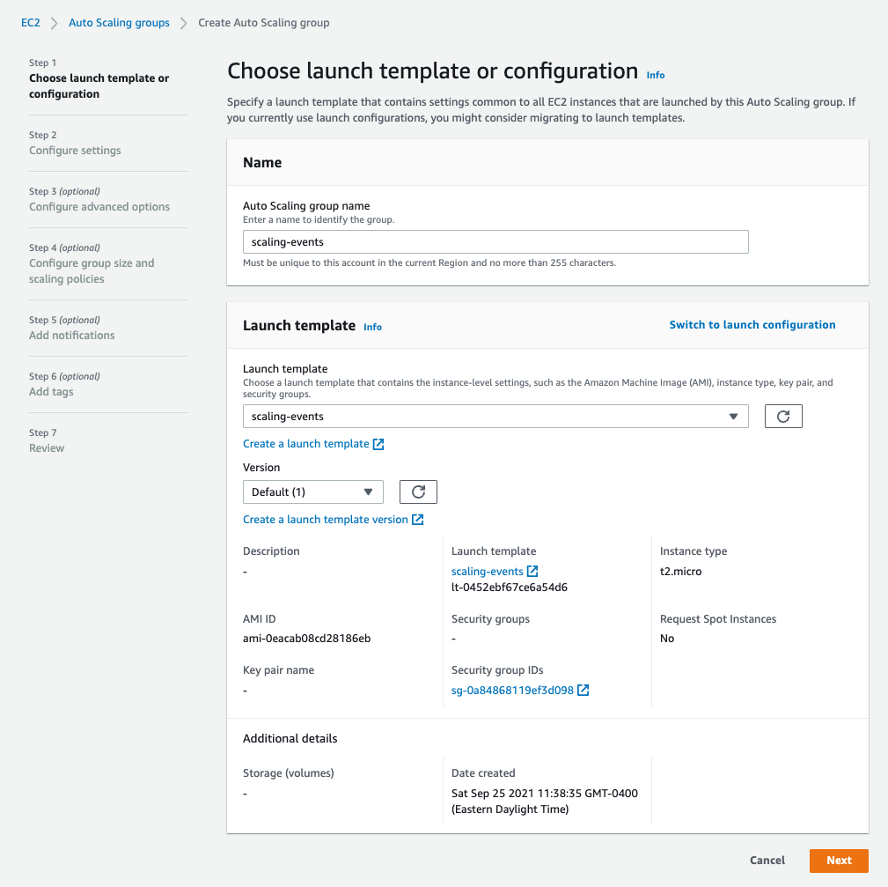
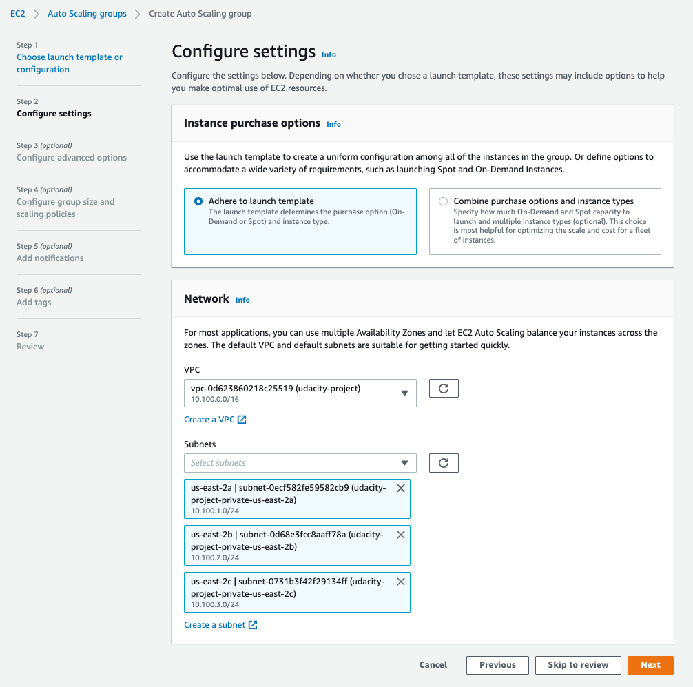
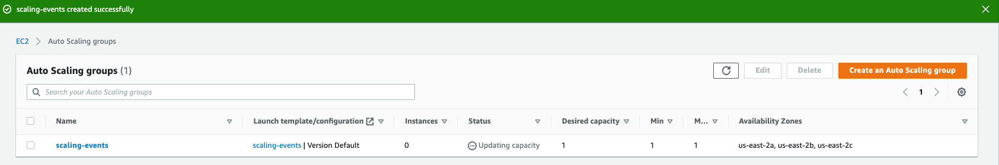

# INTRODUCTION

These examples demonstrate self-healing cloud architectures as part of Udacity course "Site Reliability Engineer".

The exercises comprise three self-healing cloud automation examples:
1. Exercise # 1 - Horizontal Scaling (local Kubernetes)
2. Exercise # 2 - EC2 Scaling (AWS)
3. Exercise # 3 - Scaling EC2 nodes in Kubernetes Clusters (AWS)

# PREPARATIONS

# Required Tools

- [Docker Desktop](https://www.docker.com/products/docker-desktop/) as Local Kubernetes Cluster
- [kubectl](https://kubernetes.io/docs/reference/kubectl/)
- [Hey Load testing](https://github.com/rakyll/hey)
- [eksctl](https://eksctl.io/introduction/#installation)


# Optional Tools: kube-ops-view
You may visualize your AWS EKS cluster in exercise 3 using the helm chart `kube-ops-view`

1. Install [helm](https://www.eksworkshop.com/beginner/060_helm/helm_intro/install/)
2. Add the stable repo: `helm repo add stable https://charts.helm.sh/stable`
3. Install the helm chart `kube-ops-view`
    ```
    helm install kube-ops-view \
    ```
   or
    ``` 
    helm stable/kube-ops-view \
    ```
   with
    ```
    --set service.type=LoadBalancer \
    --set rbac.create=True
    ```
4. Confirm the helm chart is installed successfully
    - `helm list`

5. Get the service url to view the cluster dashboard
- `kubectl get svc kube-ops-view | tail -n 1 | awk '{ print "Kube-ops-view URL = http://"$4 }'`

To remove this deployment use: `helm uninstall kube-ops-view`

# EXERCISES

## Exercise # 1 - Horizontal Scaling (local Kubernetes)

### Idea behind is to dynamically add new pods to the cluster as the load increases 

1. Ensure you have connectivity to your local Kubernetes cluster   
   1. `kubectl config use-context docker-desktop`
   2. Optional: Permanently switch namespace with `kubectl config set-context --current --namespace=udacity` and you do not need `-n udacity` at the end of every command
2. Apply the `hello-world.yml` deployment configuration file to create the `hello-world` application
    1. Run`kubectl apply -f hello.yml`
    2. Run `kubectl get pods -n udacity` to see that the `hello-world` application has deployed successfully
    3. Also check with your browser on `http://localhost:30091/`
3. You will need a running metrics server on the cluster to identify CPU/memory utilization. Apply the `metrics-server.yml` configuration provided
    1. Run `kubectl apply -f metrics-server.yml`
    2. You'll want to wait 5 minutes for the metrics server to become operational
       1. you can confirm progress of the metrics server via `kubectl get pods -n kube-system`
4. Run `kubectl top pods` to confirm the metrics server is working (you should see table with pods and cpu and memory values)
5. You will need a `HorizontalPodAutoscaler` configuration to define the rules around scaling
    1. One has been provided for you in `scale.yml` --> run `kubectl apply -f .\scale.yml`
       1. This will scale up to a max of `10` replicas and wind down to a minimum of `1` replica
       2. It is targeting (`scaleTargetRef`) the `hello-world` deployment
       3. It will trigger a scaling event based on the `metrics` section when the avg CPU utilization is >= 50% && avg memory utilization is >= 100MB
    2. Verify the running autoscaler with `kubectl get HorizontalPodAutoscaler`
6. Now we will trigger a scaling event by using [Hey](https://github.com/rakyll/hey) to load test the service
    1. Confirm the port of the service: `kubectl get services -n udacity`
    2. Linux `hey -n 1000 -c 1000 -z 1m http://localhost:30091`
    3. Windows `./hey_windows_amd64 -n 10 -c 10 -z 1m localhost:30091` using the executable from [Hey](https://github.com/rakyll/hey)
7. You can track the scaling events via these commands
   1. `kubectl get HorizontalPodAutoscaler -n udacity`
   2. `kubectl describe HorizontalPodAutoscaler hello-world -n udacity`
8. Save the results `kubectl get pods -n udacity`
9. Tear down terraform the environment
     1. `kubectl delete all --all -n udacity`
     2. `kubectl delete -f metrics-server.yml`

## Exercise # 2 - EC2 Scaling (AWS)

### Idea behind is to manually scale the number of EC2 instances in a auto-scaling group using a AMI and the Launch Template

1. Log into your student AWS account and switch to region `us-east-2`
2. Setup your local aws credentials
3. Launch a basic EC2 instance with the starter terraform code provided
    1. `terraform init`
    2. `terraform plan`
    3. `terraform apply`
4. Navigate to the EC2 service and Create an AMI of the `scale-instance` called `scaling-events`
    1. 
    2. 
    3. It takes a few minutes to create
5. Create an autoscaling `Launch Template` called `scaling-events` via AWS 
    1. Navigate to the  `EC2 -> Instances -> Launch Templates` menu
    2. Create a launch template with these fields. Leave the rest with default values
        1. name: `scaling-events`
        2. ami: `scaling-events`
        3. instance-type: `t2.micro`
        4. Security Group: `ssh-access`
        5. Resource Tags:
           1. key: `Name`
           2. value: `auto-scaled-instances`
        6. 
6. Create and autoscaling group to use the `Launch Template`
   1. Navigate to the  `EC2 -> Auto Scaling -> Auto Scaling Groups` menu
   2. Create an autoscaling group configuration called `scaling-events`
       1. associate it with the launch template `scaling-events`
           1. 
       2. launch in the `udacity-project VPC` and associate with all private subnets
           1. 
       3. skip to review and create
           1. 
   3. Take screenshot of the EC2 instances running in the environment.
   4. Trigger a scaling event with the autoscaling group by editing it and increasing:
       1. Maximum capacity to `10`
       2. Desired capacity to `3`
   5. Take screenshot of the EC2 instances running in the environment.
   6. Clean up environment by setting autoscaling groups Maximum, Minimum, Desired capacity to `0`
7. Tear down resources created for the exercise
   1. Manually delete/deregister the following resources in this order
       1. Auto Scaling Group
       2. Launch Template
       3. AMI
   2. `terraform destroy`


## Exercise # 3 - Scaling EC2 nodes in Kubernetes Clusters (AWS)

Requires [eksctl](https://eksctl.io/introduction/#installation)

### Idea behind is to automatically scales the number of Kubernetes nodes in order to support deployed pods

1. Log into your student AWS account and switch to region `us-east-2`
2. Setup your local aws credentials
3. Launch the kubernetes cluster in starter terraform code provided
    1. `terraform init`
    2. `terraform plan`
    3. `terraform apply`
4. Ensure you have connectivity to your aws kubernetes cluster
   1.`aws eks --region us-east-2 update-kubeconfig --name udacity-cluster`
   2.Change Kubernetes context to the new AWS cluster
    - `kubectl config use-context <cluster_name>` (e.g. arn:aws:eks:us-east-2:225791329475:cluster/udacity-cluster)
    3. Confirm with: `kubectl get pods --all-namespaces`
    4. Change context to `udacity` namespace
        - `kubectl config set-context --current --namespace=udacity`
5. Launch the `alot-of-services.yml` to the cluster
    1. `kubectl apply -f alot-of-services.yml`
6. Take a screenshot of the running pods: `kubectl get pods -n udacity`
7. You'll notice not all of the pods are in running state (AWS cluster can't support all of them with the initial single node). 
   1. Identity the problem with them using the `kubectl describe` command
   1. e.g `kubectl describe pod <name_of_pod>`
   2. you'll notice at the bottom in events ` 0/1 nodes are available: 1 Too many pods.`
8. To resolve this problem manually increase the cluster node size via terraform and apply
   ```
   nodes_desired_size = 4
   nodes_max_size     = 10
   nodes_min_size     = 1
      ```
9. Wait 5 mins then take a screenshot of the running pods: `kubectl get pods -n udacity`. You'll notice the pods that were in a pending are now able to be deployed successfully with the increased resources available to the cluster.
    1. Additionally, take a screenshot of the aws ec2 instances running via the console.
10. Now we will automate this following self-healing best practices that doesn't require human intervention 
11. Delete the services deployment `kubectl delete -f alot-of-services.yml`
12. Decrease the cluster node size  back to original values via terraform but leaving max size as `10` and apply
   ```
   nodes_desired_size = 1
   nodes_max_size     = 10
   nodes_min_size     = 1
   ```
13. Create a node autoscaling configuration

    1. Setup OIDC provider
   ```
   eksctl utils associate-iam-oidc-provider --cluster udacity-cluster --approve --region=us-east-2
   ```
   
    2. Create a cluster service account with IAM permissions. Update the follow commands with the AWS account number   
   ```
   eksctl create iamserviceaccount \
       --name cluster-autoscaler \
       --namespace kube-system \
       --cluster udacity-cluster \
       --attach-policy-arn "arn:aws:iam::${ACCOUNT_ID}:policy/udacity-k8s-autoscale" \
       --approve \
       --override-existing-serviceaccounts \
       --region=us-east-2      
    ```
    
14. Apply the provided `cluster_autoscale.yml` configuration to create a service that will listen for events like Node capacity reached to automatically increase the number of nodes in the cluster via `kubectl apply -f cluster_autoscale.yml`
15. In a separate tab watch the cluster-autoscale app's logs `kubectl -n kube-system logs -f deployment/cluster-autoscaler`
16. Launch the `alot-of-services.yml` to the cluster
    1. `kubectl apply -f alot-of-services.yml`
17. Wait a minute and you'll notice the number in ec2 instances beginning to increase to account for the number of services
    1. To view the pods status use `kubectl get pods -n udacity`
    2. Take a screenshot of the autoscaling group in EC2 and the running instances
18. log the output of `kubectl get pods --all-namespaces` to `scaling.txt`
19. Tear down terraform environment
    1. `eksctl delete iamserviceaccount --name cluster-autoscaler --namespace kube-system --cluster udacity-cluster --region us-east-2`
    2. `kubectl delete all --all -n udacity`
    3. `terraform destroy`

